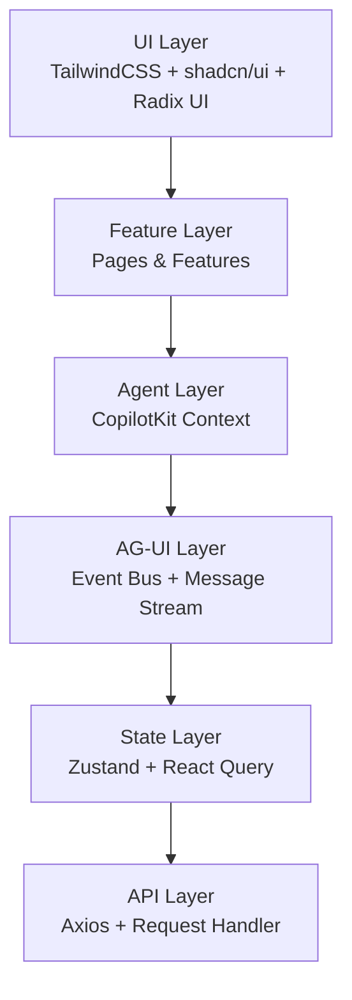

# 企业级 Agent 平台前端架构设计

## 1. 前端整体架构



### 层级职责说明

| 层级 | 职责 | 技术栈 |
|-----|------|--------|
| **UI Layer** | 基础 UI 组件、样式系统、主题管理 | TailwindCSS、shadcn/ui、Radix UI |
| **Feature Layer** | 业务功能实现、页面组合、交互逻辑 | React、TypeScript、自定义 Hooks |
| **Agent Layer** | AI Agent 能力、Copilot 上下文管理 | CopilotKit、Agent 定义 |
| **AG-UI Layer** | 实时事件管理、消息流处理、Tool 调用 | Event Bus、Message Stream |
| **State Layer** | 全局状态管理、异步数据管理 | Zustand、React Query |
| **API Layer** | HTTP 请求、错误处理、拦截器 | Axios、Request Pipeline |

---

## 2. 项目目录结构（FSD 架构）

```
dify-admin-template/
├── src/
│   ├── app/                          # 应用层配置
│   │   ├── layout.tsx               # 根布局
│   │   ├── page.tsx                 # 首页
│   │   ├── globals.css              # 全局样式
│   │   ├── providers.tsx            # 全局 Provider
│   │   └── error.tsx                # 错误页面
│   │
│   ├── pages/                        # 页面路由（App Router）
│   │   ├── (auth)/
│   │   │   ├── login/page.tsx
│   │   │   ├── register/page.tsx
│   │   │   └── forgot-password/page.tsx
│   │   ├── (workspace)/
│   │   │   ├── dashboard/page.tsx
│   │   │   ├── agents/page.tsx
│   │   │   ├── agents/[id]/page.tsx
│   │   │   ├── workflows/page.tsx
│   │   │   ├── workflows/[id]/page.tsx
│   │   │   ├── knowledge-base/page.tsx
│   │   │   ├── mcp-management/page.tsx
│   │   │   ├── prompt-center/page.tsx
│   │   │   └── settings/page.tsx
│   │   └── admin/
│   │       ├── users/page.tsx
│   │       ├── organizations/page.tsx
│   │       └── audit-log/page.tsx
│   │
│   ├── widgets/                      # 业务组件（可复用的页面级组件）
│   │   ├── dashboard/
│   │   │   ├── stats-overview.tsx
│   │   │   ├── recent-activity.tsx
│   │   │   ├── usage-chart.tsx
│   │   │   └── quick-actions.tsx
│   │   ├── agent/
│   │   │   ├── agent-chat-widget.tsx
│   │   │   ├── agent-sidebar.tsx
│   │   │   ├── tool-call-panel.tsx
│   │   │   ├── workflow-progress.tsx
│   │   │   └── approval-panel.tsx
│   │   ├── workflow/
│   │   │   ├── workflow-canvas.tsx
│   │   │   ├── node-palette.tsx
│   │   │   └── workflow-inspector.tsx
│   │   └── knowledge/
│   │       ├── knowledge-tree.tsx
│   │       ├── document-preview.tsx
│   │       └── embedding-status.tsx
│   │
│   ├── features/                     # 功能模块（业务逻辑 + UI）
│   │   ├── auth/
│   │   ├── agent/
│   │   ├── workflow/
│   │   ├── knowledge/
│   │   ├── mcp/
│   │   └── admin/
│   │
│   ├── entities/                     # 数据实体（模型、类型）
│   ├── shared/                       # 共享资源
│   ├── stores/                       # 全局状态管理（Zustand）
│   ├── copilot/                      # CopilotKit 配置
│   ├── ag-ui/                        # AG-UI 配置
│   └── middleware/
│
├── public/
├── .env.example
├── .env.local
├── tsconfig.json
├── tailwind.config.ts
├── next.config.ts
├── package.json
└── README.md
```

---

## 3. 技术栈总结

| 类别 | 技术 | 版本 |
|-----|------|------|
| **框架** | Next.js | 16 |
| React | React | 19 |
| 语言 | TypeScript | 5.x |
| 样式 | TailwindCSS | 4.x |
| UI | shadcn/ui | latest |
| 状态管理 | Zustand | 4.x |
| 数据获取 | React Query | 5.x |
| 表单 | React Hook Form | 7.x |
| 验证 | Zod | 3.x |
| HTTP | Axios | 1.x |
| AI/Agent | CopilotKit | latest |
| 图表 | ECharts | 5.x |
| 表格 | TanStack Table | 8.x |
| 包管理 | pnpm | 8.x+ |

---

## 4. 核心特性

### 4.1 多 Agent 协作
- Agent 链式调用
- 工作流编排
- 工具组合调用

### 4.2 实时交互
- SSE 消息流
- WebSocket 支持（可选）
- 事件驱动架构

### 4.3 工作流管理
- 可视化编辑器
- 节点拖拽
- 条件分支
- 循环支持

### 4.4 知识库
- 文档上传
- 自动嵌入
- 向量检索
- 语义搜索

### 4.5 权限管理
- RBAC 模型
- 细粒度权限
- 组织隔离
- 审计日志

---

## 5. 开发流程

### 启动开发

```bash
# 克隆仓库
git clone https://github.com/mqq-persistence/dify-admin-template.git
cd dify-admin-template

# 安装依赖
pnpm install

# 配置环境变量
cp .env.example .env.local

# 启动开发服务器
pnpm dev

# 访问
open http://localhost:3000
```

---

## 6. 扩展性设计

### 支持 50+ 开发人员协作

1. **模块隔离**：每个开发者独立开发各自的 feature
2. **API 约定**：统一的 API 接口定义
3. **组件库**：共享 UI 组件库
4. **状态管理**：Zustand 支持模块化状态
5. **Git 工作流**：Feature branch + PR review

### 支持 100+ 页面规模

1. **路由分组**：使用 Next.js route groups
2. **代码分割**：自动代���分割
3. **懒加载**：动态导入大型组件
4. **缓存策略**：React Query 缓存优化
5. **性能监控**：集成性能分析工具

---

## 7. 下一步行动

- [ ] 初始化项目文件结构
- [ ] 配置 ESLint + Prettier
- [ ] 创建基础 UI 组件库
- [ ] 实现认证系统
- [ ] 构建 Agent 模块
- [ ] 设计工作流编辑器
- [ ] 集成 CopilotKit
- [ ] 编写单元测试
- [ ] 配置 CI/CD
- [ ] 部署到生产环境

---

**本架构设计完全遵循企业级最佳实践，支持未来的扩展和维护。**